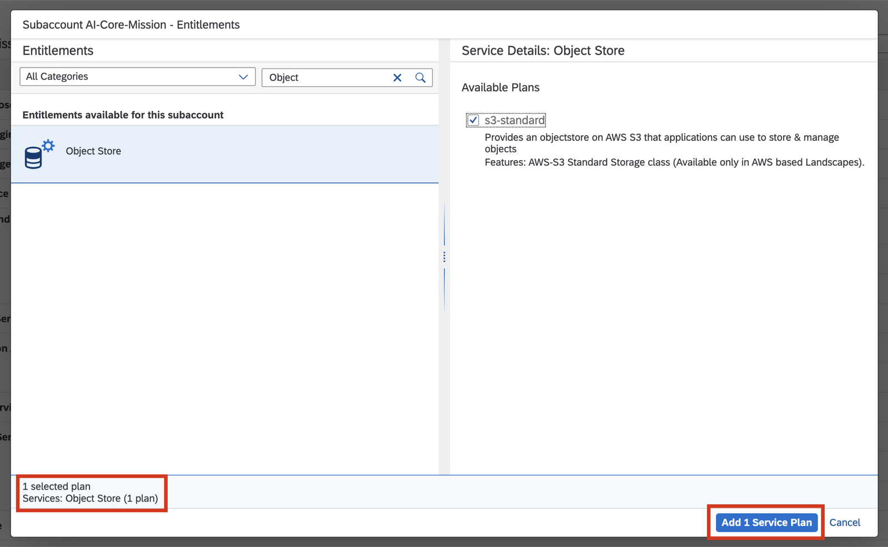
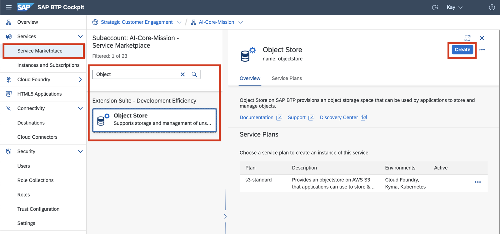
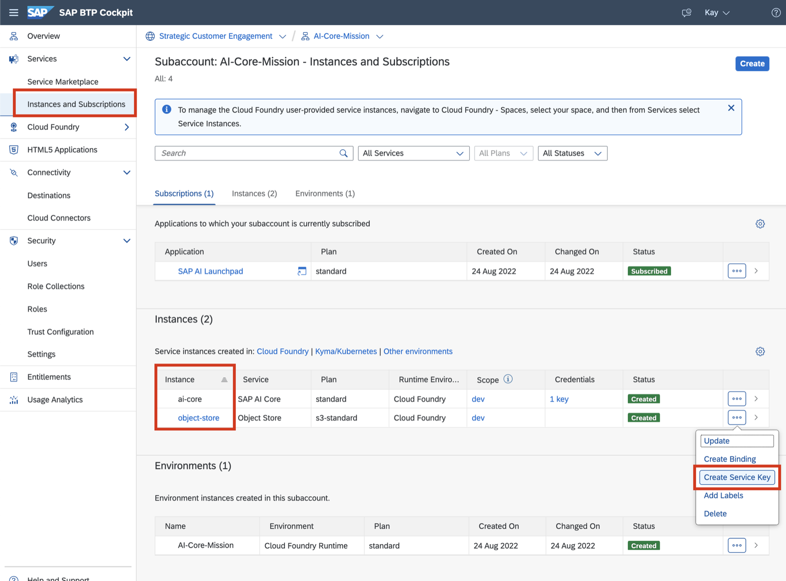

## Add Service Plans for AI Core and Object Store
To be able to create service instances of AI Core and Object Store on a subaccount, add the respective service plans and give entitlements.

Follow the procedure outlined in [Add a Service Plan](https://help.sap.com/docs/AI_CORE/2d6c5984063c40a59eda62f4a9135bee/86002d926eba4fb9ba0a80e342af7295.html?locale=en-US) on 
from the initial setup section of the help portal [Provision AI Core (incl.
Subaccount)](https://help.sap.com/docs/AI_CORE/2d6c5984063c40a59eda62f4a9135bee/38c4599432d74c1d94e70f7c955a717d.html?locale=en-US).
Since a subaccount for the purpose of AI Launchpad was already created through the
booster, it's not necessary to follow the whole guide. Besides adding the service plan and
creating an instance only for AI Core, perform the same steps also for the Object Store:

### 1. Adding Service Plans

### 2. Create service instance from Marketplace

### 3. Create a Service Key

***You might want to reduce these steps down to this booster tutorial which includes both products https://developers.sap.com/tutorials/ai-core-launchpad-provisioning.html