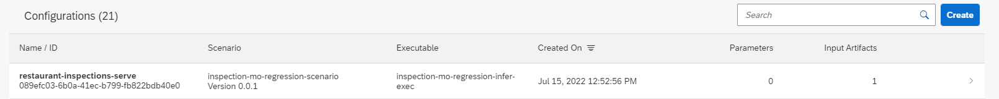
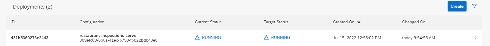

# Setup and Deployment of Inference service in AI Core

To deploy an inference service using the trained model, you need to create a serving configuration, similar to
the steps for [model training](./setup-execution-training.md).

## Serving Configuration

Again, the configuration stores metadata, like the ID of the AI Scenario, which workflow
to use, and which artifacts to use, 
in this casse, the trained model. To create the configuration, run the following code:

```python
with open(serving_workflow_file) as swf:
    serving_workflow = yaml.safe_load(swf)

scenario_id = serving_workflow['metadata']['labels']['scenarios.ai.sap.com/id']
input_artifact_name = serving_workflow['spec']['inputs']['artifacts'][0]['name']
executable_name = serving_workflow['metadata']['name']

training_output = '../training_output.json'
with open(training_output) as to:
    serving_input = json.load(to)

artifact_binding = {
    "key": input_artifact_name,
    "artifact_id": serving_input["id"]
}

serve_configuration = {
    "name": f"{resource_group}-serve",
    "scenario_id": scenario_id,
    "executable_id": executable_name,
    "parameter_bindings": [],
    "input_artifact_bindings": [ InputArtifactBinding(**artifact_binding) ]
}

serve_config_resp = ai_api_v2_client.configuration.create(**serve_configuration)

assert serve_config_resp.message == 'Configuration created'

pprint(vars(serve_config_resp))
print("configuration for serving the model created")
```

If the serving configuration has been created successfully, it should show
in AI Launchpad under the ML Operations > Configurations app where the
Training configuration was listed.



## Deploy Inference Service

AI Core can now use the information from the serving configuration to deploy the
inference service amd make the trained model available for inference requests. To do so,
run this code:

```python
deployment_resp = ai_api_v2_client.deployment.create(serve_config_resp.id)
pprint(vars(deployment_resp))

status = None
while status != Status.RUNNING and status != Status.DEAD:
    time.sleep(5)
    clear_output(wait=True)
    deployment = ai_api_v2_client.deployment.get(deployment_resp.id)
    status = deployment.status
    print('...... deployment status ......', flush=True)
    print(deployment.status)
    pprint(deployment.status_details)

    if deployment.status == Status.RUNNING:
        print(f"Deployment with {deployment_resp.id} complete!")

time.sleep(10)
```

AI Core will need some time to finish deploying the inference service. Once
the inference service has been deployed the deployment should be marked as *RUNNING* in AI
Launchpad under the Deployments tab.

