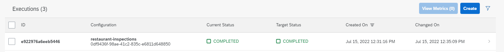

# Setup and Execution of Training in AI Core

In order to train the model, you need to create a *training configuration*. This contains
information about which workflow to use, input artifacts, (here the
training dataset) and some more metadata like the ID of the AI Scenario. AI Core uses this configuration
to execute the model training.

## Training Configuration

To create a training configuration, run the following code:

```python
input_artifact_name = training_workflow['spec']['templates'][0]['inputs']['artifacts'][0]['name']
executable_name = training_workflow['metadata']['name']

artifact_binding = {
    "key": input_artifact_name,
    "artifact_id": artifact_resp.id
}

train_configuration = {
    "name": resource_group,
    "scenario_id": scenario_id,
    "executable_id": executable_name,
    "parameter_bindings": [],
    "input_artifact_bindings": [ InputArtifactBinding(**artifact_binding) ]
}

train_config_resp = ai_api_v2_client.configuration.create(**train_configuration)
pprint(vars(train_config_resp))

assert train_config_resp.message == 'Configuration created'

print("Configuration created for running the training")
```

If the configuration has been created successfully, the configuration should also be
listed in AI Launchpad under the ML Operations > Configurations tab. Make sure to select
your respective resource group for this mission beforehand in the Workspaces app on the
left.


## Training Execution

To start training, run:

```python
execution_resp = ai_api_v2_client.execution.create(train_config_resp.id)
pprint(vars(execution_resp))

status = None
while status != Status.COMPLETED and status != Status.DEAD:
    time.sleep(5)
    clear_output(wait=True)

    execution = ai_api_v2_client.execution.get(execution_resp.id)
    status = execution.status
    print('...... execution status ......', flush=True)
    print(f"Training status: {execution.status}")
    print(f"Training status details: {execution.status_details}")


if execution.status == Status.COMPLETED:
    print(f"Training complete for execution [{execution_resp.id}]!")
    output_artifact = execution.output_artifacts[0]
    output = {
        "id": output_artifact.id,
        "name": output_artifact.name,
        "url": output_artifact.url
    }
    with open('../training_output.json', 'w') as fp:
        json.dump(output, fp)
```

AI Core will now take some time to train the model. Once it has finished
the execution should be also marked as finished in AI Launchpad.

